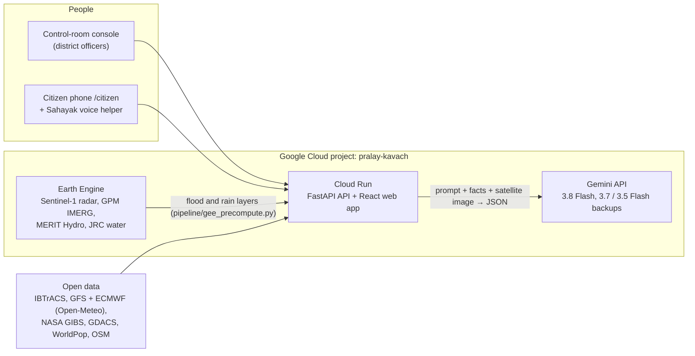

# Pralay Kavach (प्रलय कवच, "shield against the deluge")

Anticipatory action for Bay of Bengal cyclones: from the first forecast to evacuation, alerts and
parametric payouts. The prototype replays **Cyclone Fani (Odisha, May 2019)** on real data and watches the Bay live.

> **Build with AI: Code for Communities** (Google Cloud × Hack2skill) · Track: **Resilience**
> Built on **Gemini 3.8 Flash** (Google AI Studio), **Google Earth Engine** and **Cloud Run**, all in one Google Cloud project.
> Pitch deck: [PowerPoint](docs/Pralay-Kavach-pitch-deck.pptx) · [PDF](docs/Pralay-Kavach-pitch-deck.pdf)

## The problem

India's east coast takes most of the country's cyclones. Warnings now arrive days ahead, but the steps between a forecast
and a family reaching a shelter are still manual: working out who must move, writing advisories in Odia, Telugu and Bengali,
getting sign-off, and finding out afterwards where the water actually stood. Every hour lost there is an hour of evacuation time lost.
Pralay Kavach links those steps into one flow for the district control room, and gives residents a voice helper in their own language.

## Where Google AI and Google Cloud fit



| Gemini does | Where (prompt lives here) |
|---|---|
| **Planning agent**: reads the IMD-style bulletin and a MODIS satellite image (multimodal), then ranks villages and explains why, using only the model outputs it is given | `backend/app/agent.py` (`SYSTEM` + step prompts) |
| **Multilingual advisories** in Odia, Telugu, Bengali and English, each with an English back-translation for the approving officer, exported as CAP 1.2 | `backend/app/advisory.py` |
| **Sahayak voice helper** in six languages, grounded on the person's live situation, with safety rules enforced in code | `backend/app/bot.py` (`SYSTEM`) |
| **Photo check**: verifies citizen photos of rising water and estimates the depth | `backend/app/citizen.py` |

All model calls go through one function, `llm.ask_json` in `backend/app/llm.py`: JSON out, a time limit, busy-model retries onto
backup Gemini models, and a rule-based fallback so the demo never breaks. Earth Engine produces the observed flood map and the
waterlogging layers; Cloud Run serves the API and the web app from one container.

## Built for one coast, ready for others

Nothing in the pipeline is specific to Odisha. Storm tracks come from IBTrACS (every basin), forecasts from global GFS and ECMWF,
satellite layers from global NASA and Copernicus data, population from WorldPop and roads from OpenStreetMap. Pointing it at another
coast means changing the map extent and the language list. Examples: India's own Sundarbans and Andhra coast, and across BRICS **Mozambique**
(Idai, Freddy), **South Africa**'s KwaZulu-Natal coast, **China**'s Guangdong typhoon coast, and **Brazil**'s south (Catarina).
Gemini handles the local languages (Portuguese, Mandarin, Zulu) without new templates.

## What it does

### Live mode (every day, for everyone)

| Feature | Source |
|---|---|
| Animated wind flow over the Bay, 72 h ahead | GFS via Open-Meteo, 1.5° grid, refreshed every 30 min |
| Live satellite layers: clouds (every 10 min), rain rate (every 30 min), ocean wind, true colour | NASA GIBS: Himawari-9 infrared, GPM IMERG, SSMI, VIIRS |
| Active and recent cyclones with tracks and wind zones | GDACS (EU JRC / UN OCHA) |
| Sea temperature ("cyclone fuel") | Open-Meteo marine |
| **Forming-storm detector**: a closed low under 1004 hPa with 50+ km/h winds over the sea, that GFS **and** ECMWF both show, lasting 12+ hours | Pattern check on two forecast models |
| Plain-language outlook for any place (all clear / watch / danger), also on the citizen phone | Open-Meteo point forecast + the above |

**Track record:** `python -m pipeline.tune_genesis` tests the detector on GFS and ECMWF forecasts *as issued* 1–5 days ahead
(Open-Meteo previous-runs archive) against IBTrACS. Filters are chosen on 2024 only and scored on 2025–26, which they never saw:

| | False alarms, 2024 (choose) | False alarms, 2025–26 (held out) |
|---|---|---|
| Single model (first version) | 16 of 31 | 18 of 34 (53%) |
| **GFS + ECMWF agree, 12+ h** | **0 of 7** | **0 of 7** |

Storms spotted: Remal 9.6 d, Dana 7.0 d, Fengal 10.8 d, Montha 7.1 d and ONE-26 5.0 d before landfall; **Ditwah (Nov 2025) missed**.
Six storms is a small sample. Results show on the Live screen.
The live feeds refresh when the models update (GFS 3 h, ECMWF 6 h) and are cached on disk, so a rate limit or outage serves the last good copy with its age shown.
Everything live is guidance; official warnings come from IMD and the State Disaster Management Authority, and the app says so.

### Sahayak: the voice helper on the citizen's phone

Talk to it in Odia, Hindi, Bengali, Telugu, Tamil or English; it answers aloud in short, calm sentences.
- **Grounded:** every answer uses the person's live situation (district alert, their shelter and whether the route floods,
  the 3-day outlook, nearby water reports), so it does not make up storm facts.
- **Acts, not just talks:** files water reports (which reroute others), sends rescue requests to the officer console (SOS),
  gives route and call buttons, and pre-fills WhatsApp/SMS to family saved on the phone.
- **Rings when an alert is dispatched**, reads it aloud in the person's language, then asks if they need help.
- **Safety rules in code, not just the prompt:** danger words in six languages always put "Call 112" first and file a rescue
  request; it never contradicts an evacuation order; replies come within 25 s or it falls back to rules.
- Voice uses the phone's speech engine (Android Chrome handles Indian languages); the same `/api/bot/chat` engine can sit behind
  an IVR phone line or WhatsApp.

### Replay mode (Cyclone Fani, 2019)

| Screen | What happens | Real or simplified |
|---|---|---|
| **Command** | Replay Fani from T−72h. Observed track, forecast track, cone, landfall. | Real IBTrACS best track. Hindcast: the "forecast" is the best track, widened by a cone sized to IMD's typical track error. |
| **Risk** | Storm-surge flood depth, people to evacuate, hospitals and substations at risk, cut roads, three track scenarios. | Real elevation and bathymetry, WorldPop population, OSM assets. Surge is a first-order screening model (see below). |
| **Plan** | An agent reads the bulletin and satellite image, runs the models, ranks villages and explains why. Every step streams to the UI. | Real model outputs. Reasoning comes from Gemini (with a key) or rules (without). |
| **Dispatch** | Multilingual advisory (Odia, Telugu, Bengali, English), CAP 1.2 XML, two-person approval, then dispatch. | CAP is real and standard. Dispatch goes to the citizen view, not to live SMS/WhatsApp. |
| **Citizen phone** (`/citizen`) | Receives the alert, reads it aloud, shows the resident's own shelter and route, and takes photo reports of rising water that reroute them. | Shelter routing uses a straight-line check against the flood layer. |
| **Verify** | Where water actually stood after landfall (Sentinel-1 radar), villages to send relief to, honest checks of the forecast, and wind and flood parametric payouts. | Real Sentinel-1 data. Sums insured are demo assumptions. |

Headline checks against what really happened:
- **Evacuation:** the model says about **9.2 lakh people** needed to move, mostly in Puri; Odisha actually evacuated about 12 lakh (1.2 million).
- **Waterlogging:** the forecast layer flags 4.5% of the land, which held 25% of the standing water Sentinel-1 saw on 4 May, **5.4× better than chance**. Scored with spatial cross-validation: thresholds fitted on one half of a checkerboard of ~40 km blocks, scored on the other half.
- **Surge:** not checkable with satellite radar. The surge drained within hours; the first pass came about 20 hours after landfall. The app says so rather than showing a score.

## Run it

```bash
./dev.sh
```

Then open http://localhost:5173 (console) and http://localhost:5173/citizen (resident phone) side by side.

The first run creates the Python venv, downloads about 60 MB of open data into `backend/data/` and installs npm packages.

### Add the AI

Copy `.env.example` to `.env` and set `GEMINI_API_KEY` (from [Google AI Studio](https://aistudio.google.com/apikey)).
`GEMINI_MODEL` defaults to `gemini-3.8-flash`; `GEMINI_BACKUP_MODELS` (default `gemini-3.7-flash,gemini-3.5-flash`) are tried
when the main model is busy.
Without a key, everything still works in rule-based mode, and the top bar says so.
The app never crashes on a model error: it falls back to rules and shows a warning.

### Demo state

Plans, advisories, dispatches and citizen reports are saved to `backend/data/state.json`, so a restart keeps them.
**Reset demo** in the top bar clears them for a fresh run.

### Add the Earth Engine layers

```bash
cd backend
.venv/bin/pip install earthengine-api
.venv/bin/earthengine authenticate
EE_PROJECT=<your-cloud-project> .venv/bin/python -m pipeline.gee_precompute
```

This pulls:
- the Sentinel-1 flood map: same-orbit change detection, pre-storm April vs 3–8 May 2019, with permanent water (JRC) and slopes masked;
- GPM IMERG storm rainfall (2–4 May) and MERIT Hydro height above nearest drainage, for the waterlogging layer.

## Demo script (about 4 minutes)

0. **Live**: today's Bay: animated wind, Himawari clouds from minutes ago, sea temperature, last week's storm, the track record, and a place's outlook.
1. **Replay**: press play. Fani crosses the Bay; the cone narrows onto Puri.
2. **Risk**: surge layer, 9.2 lakh people to move, hospitals in extreme wind. Switch to the southern track.
3. **Generate action plan**: watch the six agent steps stream, then click through the ranked villages and their reasons.
4. **Approve plan → Dispatch**: write the Puri advisory in Odia, check the back-translation, approve as the duty officer, then as the Relief Commissioner.
5. **Citizen phone**: the phone rings; answer it and the alert is read aloud. Ask Sahayak "water is coming into my house" in Odia: it tells you to call 112, files the rescue request (watch the SOS badge appear on the console) and a water report. The alert arrives within 3 seconds. Tap *Listen*, then *Report water → On my way to shelter → Waist*. The resident is rerouted.
6. **Verify**: where water actually stood, relief priorities, the 5.4× waterlogging check, 9.2 vs 12 lakh evacuation, and parametric payouts.

## Architecture

```
frontend/  React + Vite + MapLibre (CARTO dark basemap)
backend/
  app/
    storm.py      track interpolation, Holland (1980) wind/pressure, cone, track scenarios
    surge.py      surge screening model + flood spread over the elevation model
    rainflood.py  waterlogging-prone land (HAND, slope, rainfall)
    exposure.py   people, villages, assets, roads, shelters, wind exposure, parametric triggers
    agent.py      the planning agent (streams steps over SSE)
    advisory.py   multilingual advisories, CAP 1.2, two-person approval
    citizen.py    resident feed, photo reports, rerouting
    validate.py   satellite flood map, spatial cross-validation, evacuation check
    store.py      saves demo state to disk
    live.py       live wind grid, satellites, GDACS storms, forming-storm detector, personal outlook
    bot.py        Sahayak voice helper: grounded replies, actions, safety rules, SOS requests
    llm.py        Gemini / Claude / rule-based behind one interface
    main.py       FastAPI routes
  pipeline/
    fetch_open_data.py   IBTrACS, Terrarium DEM, WorldPop, OSM (Overpass), GeoNames, NASA GIBS
    gee_precompute.py    Earth Engine: Sentinel-1 flood extent, GPM IMERG rain, MERIT Hydro HAND, JRC water
    tune_genesis.py      train/test tuning of the forming-storm detector on forecasts as issued (GFS + ECMWF)
    backtest_genesis.py  first single-model backtest (kept for comparison)
```

### The surge model, honestly

At every coastal cell, for every hour of the approach:
`surge = 1 cm per hPa pressure drop + K × shelf factor × onshore wind² + tide allowance`.
The shelf factor comes from real bathymetry. The peak level then spreads inland, losing 0.12 m per km,
into land that is hydraulically connected to the sea. It is a prioritisation tool, not a hydrodynamic model like ADCIRC.
Evacuation also counts destructive wind (≥120 km/h within 20 km of the coast), which is how Odisha decides who moves.

### Known simplifications

- Shelters are OSM schools and colleges; OSM barely maps Odisha's cyclone shelters. Swap in the OSDMA registry.
- Districts are assigned by nearest district HQ, not census boundaries.
- Routes are straight-line checks, not road routing. The Google Maps Routes API is the next step.
- Pixel-level overlap with the radar flood map is low (IoU about 0.01–0.02): the observed water is patchy and sparse. Report the held-out lift and the village-level relief list, not pixel IoU.

## Deploy (Cloud Run)

```bash
gcloud run deploy pralay-kavach --source . --region asia-south1 --allow-unauthenticated \
  --set-env-vars GEMINI_API_KEY=...,GEMINI_MODEL=gemini-3.8-flash
```

The Dockerfile builds the web app, fetches the open data at build time and serves everything from one FastAPI process.

## Data sources

IBTrACS v04r01 (NOAA NCEI) · Terrarium elevation tiles (AWS Open Data, SRTM/GEBCO) · WorldPop 2020 ·
OpenStreetMap contributors (ODbL) · GeoNames (CC BY 4.0) · NASA GIBS MODIS Terra · Copernicus Sentinel-1, NASA GPM IMERG, MERIT Hydro and JRC Global Surface Water (via Earth Engine) ·
Basemap © CARTO, © OpenStreetMap contributors.

## Open-source components

React, Vite and TypeScript (MIT) · MapLibre GL JS (BSD-3) · FastAPI, Uvicorn, Pydantic, HTTPX (MIT/BSD) · NumPy, SciPy, Pillow (BSD/HPND) ·
Google Gen AI SDK `google-genai` (Apache-2.0) · Earth Engine Python API (Apache-2.0).
The wind field follows Holland (1980), *An analytic model of the wind and pressure profiles in hurricanes*, Monthly Weather Review 108.

## Licence

MIT. See [LICENSE](LICENSE). Data keeps its own licence (see Data sources).
